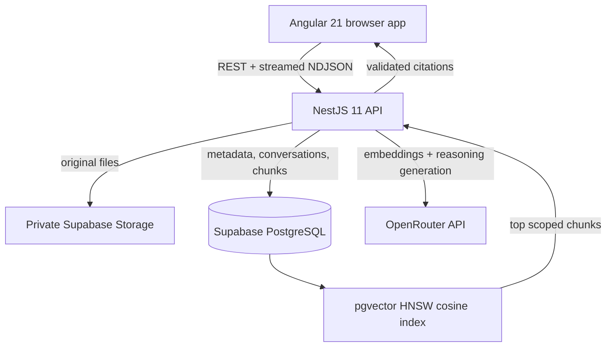

# Grounded

Grounded is a full-stack document intelligence application. Upload private PDF, DOCX, text, or Markdown files; ask questions across all or selected documents; receive a progressively streamed answer; and inspect the exact chunks supporting each citation.

It is a real retrieval-augmented generation system: documents are extracted, chunked, embedded through OpenRouter, indexed in Supabase PostgreSQL with pgvector, retrieved by semantic similarity, and passed to a reasoning-enabled, schema-constrained model response. Retrieval and citations are never simulated.

## Why I Built Grounded

Grounded demonstrates production-oriented Angular development, strict TypeScript, AI API integration, Retrieval-Augmented Generation, prompt engineering, semantic document search, vector databases, streaming AI interfaces, backend API design, database design, and full-stack architecture. It is designed as a real software engineering portfolio project: behavior is testable, trust boundaries are explicit, and model output is validated rather than accepted blindly.

## Screenshots

Add desktop chat, document library, mobile navigation, source preview, and Prompt Playground screenshots here after connecting a Supabase project and uploading the included sample documents.

## Features

- PDF, DOCX, TXT, and Markdown upload with 15 MB validation on client, API, and Storage
- Private original-file storage in Supabase
- Page-aware PDF parsing, DOCX extraction, text normalization, paragraph-aware overlapping chunks
- Batched OpenRouter embeddings stored in a 1,536-dimensional pgvector column
- Scoped top-k cosine retrieval using an indexed PostgreSQL function
- Strictly delimited, prompt-injection-aware document context
- OpenRouter reasoning with structured JSON-schema output plus Zod validation
- Progressive newline-delimited JSON streaming to Angular with stop/cancel support
- Backend citation allow-listing against the exact retrieved chunk IDs
- Source side panel with document, page, section, and exact retrieved text
- Persistent conversations, messages, validated citations, and generated titles
- Document status polling, deletion with cascading vector cleanup, viewing, and reprocessing
- Prompt Playground with five presets, model/default controls, final prompt inspection, retrieval ranks and similarity, latency, token metrics, and keyword evaluation
- Responsive standalone Angular components, Signals, computed state, RxJS, Reactive Forms, route lazy loading, HTTP interceptor, focus states, and semantic controls
- Backend DTO validation, global errors, security headers, CORS, typed Supabase access, and provider-isolated OpenRouter integration

## Architecture



Angular owns presentation and browser interaction only. NestJS owns credentials, upload validation, extraction, chunking, embeddings, retrieval, prompt construction, structured generation, citation validation, and persistence. The browser never receives an OpenRouter key or Supabase service role.

See [architecture](docs/architecture.md), [RAG pipeline](docs/rag-pipeline.md), [prompt engineering](docs/prompt-engineering.md), [database](docs/database.md), and [API](docs/api.md).

## How RAG Works

1. A file is validated and stored privately.
2. Text is extracted and normalized.
3. Paragraph blocks become approximately 500–800-token chunks with about 110 tokens of overlap.
4. OpenRouter generates embeddings in batches.
5. PostgreSQL stores chunk text, metadata, and vectors.
6. A question embedding is compared with indexed chunk vectors, respecting document scope.
7. Only the top relevant chunks are enclosed in an untrusted document-context boundary.
8. OpenRouter streams a reasoning-enabled strict structured response.
9. Zod validates the final object. Citation IDs are intersected with retrieved IDs.
10. Angular renders progressive text and trusted source cards.

## Technology Stack

| Layer     | Technology                                                                                                       |
| --------- | ---------------------------------------------------------------------------------------------------------------- |
| Frontend  | Angular 21, standalone components, TypeScript 5.9, Signals, RxJS, Reactive Forms, Tailwind CSS 4, Lucide Angular |
| Backend   | NestJS 11, Node.js 22, TypeScript, OpenRouter SDK, Supabase JS 2, Zod, class-validator                           |
| Documents | pdf-parse, Mammoth, UTF-8 text/Markdown parser                                                                   |
| Data      | Supabase PostgreSQL, pgvector, private Supabase Storage                                                          |
| Tests     | Angular build test runner with Vitest, Jest for NestJS                                                           |
| Quality   | ESLint 9, Angular ESLint, Prettier, strict TypeScript                                                            |

Angular 21 is the newest stable Angular line compatible with Node 22.18 used to build this repository. Angular 22 requires a newer Node 22 patch.

## Project Structure

```text
grounded/
├── frontend/                 Angular application
│   └── src/app/
│       ├── core/             Models, stateful services, HTTP concerns
│       ├── features/         Chat, documents, playground, settings
│       ├── layout/           Responsive application shell
│       └── shared/           Scope selector and citation panel
├── backend/                  NestJS API
│   └── src/
│       ├── ai/               Provider, prompts, schema, stream parsing
│       ├── chat/             RAG orchestration and NDJSON endpoint
│       ├── conversations/    History persistence
│       ├── database/         Typed Supabase client
│       ├── documents/        Upload and processing pipeline
│       ├── playground/       Prompt experiments and evaluation
│       └── retrieval/        Query embeddings and vector RPC
├── supabase/migrations/      PostgreSQL, pgvector, RLS, and Storage SQL
├── docs/                     Interview-oriented technical documentation
│   └── sample-data/          Original files ready to upload
├── .env.example
└── package.json              npm workspaces and root commands
```

## Prerequisites

- Node.js 22.12 or newer (Node 22 LTS recommended)
- npm 10 or newer
- A Supabase project
- An OpenRouter API key with access to the configured chat and embedding models
- Supabase CLI only if you prefer CLI migrations; the SQL editor also works

## Installation

```bash
git clone <your-repository-url>
cd grounded
npm install
```

Copy the example environment file to `.env` at the repository root and replace its example values:

```bash
cp .env.example .env
```

PowerShell:

```powershell
Copy-Item .env.example .env
```

NestJS checks local overrides first, then `backend/.env` and the repository-root `.env`.

## Supabase and pgvector Setup

1. Create a Supabase project.
2. Open the SQL editor and run `supabase/migrations/202608240001_initial_schema.sql`, or link the Supabase CLI and run:

   ```bash
   supabase db push
   ```

3. Confirm the `documents` Storage bucket is private.
4. Copy the project URL and service role key from Supabase project settings into `.env`.

The migration enables `vector` and `pgcrypto`; creates the tables, foreign keys, cascades, checks, triggers, HNSW index, and similarity function; enables RLS; revokes browser-role access; creates the private bucket; and seeds the prompt-preset table.

The code presets are authoritative at runtime. The table is included so presets can move to data-managed configuration later without a schema change.

## Environment Variables

| Variable                           | Required | Purpose                                                                    |
| ---------------------------------- | -------- | -------------------------------------------------------------------------- |
| `SUPABASE_URL`                     | Yes      | Supabase project URL                                                       |
| `SUPABASE_SERVICE_ROLE_KEY`        | Yes      | Backend-only database and Storage access                                   |
| `OPENROUTER_API_KEY`               | Yes      | Backend-only OpenRouter credential                                         |
| `OPENROUTER_CHAT_MODEL`            | No       | Reasoning chat model; defaults to `stealth/ox-alpha`                       |
| `OPENROUTER_EMBEDDING_MODEL`       | No       | Must produce 1,536 dimensions; defaults to `openai/text-embedding-3-small` |
| `OPENROUTER_REASONING_EFFORT`      | No       | `none`, `minimal`, `low`, `medium`, `high`, `xhigh`, or `max`              |
| `OPENROUTER_MAX_COMPLETION_TOKENS` | No       | Completion and reasoning budget; defaults to `4096`                        |
| `OPENROUTER_SITE_URL`              | No       | Optional app attribution URL                                               |
| `OPENROUTER_APP_NAME`              | No       | Optional app attribution title; defaults to `Grounded`                     |
| `SUPABASE_STORAGE_BUCKET`          | No       | Defaults to `documents`                                                    |
| `FRONTEND_URL`                     | No       | CORS origin; defaults to `http://localhost:4200`                           |
| `PORT`                             | No       | API port; defaults to `3000`                                               |

No Supabase anon key is required because Angular does not access Supabase directly.

## Running Locally

Start both workspaces from the repository root:

```bash
npm run dev
```

- Angular: `http://localhost:4200`
- NestJS health: `http://localhost:3000/api/health`

The Angular development server proxies `/api` to port 3000. Upload [employee-handbook.md](docs/sample-data/employee-handbook.md) and [product-return-policy.md](docs/sample-data/product-return-policy.md) to test retrieval immediately.

Run applications individually when needed:

```bash
npm run start --workspace frontend
npm run start:dev --workspace backend
```

## Quality Commands

```bash
npm run lint
npm run typecheck
npm test
npm run build
npm run format:check
```

Backend tests mock provider behavior and require no OpenRouter key. They cover provider configuration, reasoning requests, embedding dimensions, upload validation, sanitization, chunking, retrieval scope, prompt construction, structured response validation, progressive answer extraction, and citation allow-listing. Frontend tests cover application routing, signal-backed document loading, upload progress, and document scope output.

## Prompt Engineering Approach

The production system prompt is centralized in `backend/src/ai/prompts.ts`. It treats retrieved text as untrusted reference data, prohibits document instructions from changing system behavior, requires insufficient-evidence responses, and restricts citation IDs to context. Context and question boundaries are explicit. Normal chat uses a low temperature; the Playground safely exposes bounded experimentation. See [prompt-engineering.md](docs/prompt-engineering.md) for interview-ready reasoning.

## Security Notes

- Keep `.env` private. It is ignored by Git.
- Never place the OpenRouter key or Supabase service role in Angular.
- Filenames are normalized, MIME and extension are checked, Multer is memory-bound, and three layers enforce a 15 MB limit.
- The private bucket and database are accessible only through the backend service role.
- Retrieved text cannot invoke tools or code and is explicitly marked untrusted.
- Model citations do not control source metadata and unknown chunk IDs are removed.
- This version is single-user. Protect any internet-facing deployment with private network access, an identity-aware proxy, or add application authentication before exposing personal documents.

## Deployment

Recommended path:

1. Supabase hosts PostgreSQL, pgvector, and private file Storage.
2. Railway deploys the repository using [railway.json](railway.json). Set all backend environment variables and use `/api/health` for health checks.
3. Netlify deploys Angular using [netlify.toml](netlify.toml), or Vercel uses `npm run build --workspace frontend` with `frontend/dist/frontend/browser` as output.
4. Configure the frontend host to reverse proxy `/api/*` to the Railway backend, preserving the `/api` prefix. Set `FRONTEND_URL` to the final frontend origin.
5. For Angular routing, retain the included Netlify SPA fallback or an equivalent Vercel rewrite to `index.html` after the API proxy rule.

The frontend is static. The backend requires a Node runtime but not Docker.

## Future Improvements

- Supabase email authentication with per-user IDs, Storage paths, and RLS policies
- Hybrid keyword/vector retrieval and reranking
- OCR for scanned PDFs
- Background queue for large ingestion workloads
- Semantic answer evaluation and regression datasets
- Shareable read-only conversations with explicit access controls
- Additional provider implementations behind `AiProvider`

## Documentation Index

- [Architecture](docs/architecture.md)
- [RAG pipeline](docs/rag-pipeline.md)
- [Prompt engineering](docs/prompt-engineering.md)
- [Database](docs/database.md)
- [API](docs/api.md)
