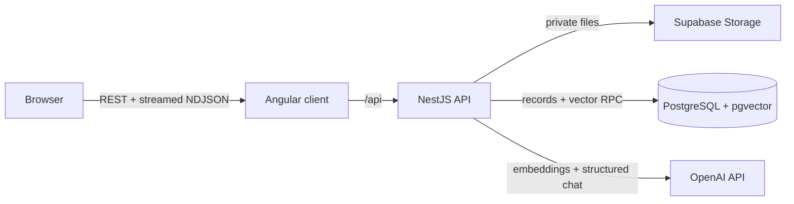

# Grounded architecture

Grounded is a two-application TypeScript monorepo. Angular is a static client; NestJS owns secrets, validation, persistence, document processing, retrieval, and model calls. Supabase provides private object storage and PostgreSQL with pgvector.

## Frontend boundaries

- `core/models` is the shared browser domain vocabulary.
- `core/services` owns HTTP, streamed fetch parsing, and signal-backed application state.
- `features` contains route-level standalone components for chat, documents, playground, and settings.
- `shared` contains the document-scope selector and citation source panel.
- The app shell owns responsive navigation and recent conversation links.

Angular Signals represent synchronous view state. RxJS represents finite HTTP workflows, polling, progress, and cleanup. Reactive Forms own prompt inputs. The chat response uses `fetch` because `HttpClient` does not expose incremental response bytes consistently across browsers.

## Backend boundaries

- `documents` validates uploads, stores originals, extracts text, chunks content, requests embeddings, and persists vectors.
- `retrieval` embeds a question and invokes the scoped pgvector similarity function.
- `ai` defines the provider boundary, central prompt, structured schema, partial JSON stream extraction, and OpenAI implementation.
- `chat` coordinates retrieval, persistence, generation, cancellation, and citation validation.
- `conversations` owns conversation and message records.
- `playground` exposes prompt experimentation, retrieval diagnostics, metrics, and basic keyword evaluation.
- `database` holds the typed Supabase client.

## Trust boundaries

The Angular bundle contains no OpenAI or Supabase service credentials. The Supabase tables, RPC, and private Storage bucket are inaccessible to `anon` and `authenticated` browser roles. Only the backend service role accesses them. Uploaded text is untrusted data and is delimited from both system and user instructions before model generation.

## Operating mode

Version 1 is intentionally a single-user workspace. It is suitable for local use or a privately protected deployment. It does not expose Supabase directly to the client. Multi-user authentication would add a verified user ID to every table and query plus per-user Storage paths and RLS policies.
